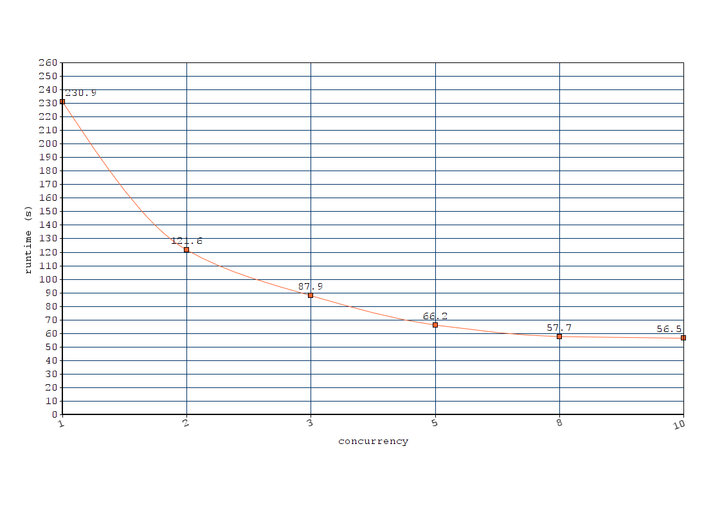

# Simple node.js client for GROBID REST services

This node.js module can be used to process in an efficient concurrent manner a set of PDF in a given directory by the [GROBID](https://github.com/kermitt2/grobid) service. Results are written in a given output directory and include the resulting XML TEI representation of the PDF. 

## Build and run

You need first to install and start the *grobid* service, latest stable version, see the [documentation](http://grobid.readthedocs.io/). By default, it is assumed that the server will run on the address `http://localhost:8070`. You can change the server address by editing the config  file `config.json`.

Install the present module:

> npm install

Usage (GROBID server must be up and running): 

> node main -in *PATH_TO_THE_PDFS_TO_PROCESS* -out *WHERE_TO_PUT_THE_RESULTS*

Example:

> node main -in ~/tmp/in -out ~/tmp/out

Only the files with extension `.pdf` present in the input directory (`-in`) will be processed, the other files will be ignored. Results will be written in the output directory (`-out`), reusing the file name with a different file extension (`.tei.xml`).

Other parameters 

* `n`: the number of concurrent call to GROBID, default is `10`

* the service to be called, default being `processFulltextDocument` (full processing of the document body), other possibilities are `processHeaderDocument` (only extracting and structuring the header) and `processReferences` (only extracting and structuring the bibliographical references). 

Example: 

> node main -in ~/tmp/in -out ~/tmp/out -n 20 processHeaderDocument

This command will extract the header of the PDF files under `~/tmp/in` with 20 concurrent calls to the GROBID server and write the TEI results under `~/tmp/out`.

## Benchmarking

Full text processing of __136 PDF__ (total 3443 pages, in average 25 pages per PDF) on Intel Core i7-4790K CPU 4.00GHz, 4 cores (8 threads), 16GB memory, n being the concurrency parameter:

| n  | runtime (s)| s/PDF | PDF/s |
|----|------------|-------|-------|
| 1  | 230.9 | 1.69       | 0.59 |
| 2  | 121.6 | 0.89       | 1.12 |
| 3  | 87.9  | 0.64       | 1.55 |
| 5  | 66.2  | 0.48       | 2.05 |
| 8  | 57.7  | 0.42       | 2.35 |
| 10 | 56.5  | 0.41       | 2.41 |

As complementary info, GROBID processing of header of the 136 PDF and with `n=10` takes 5.37 s (8 times faster than the complete full text processing because only the two first pages of the PDF are considered), 25.33 PDF/s. In similar conditions, extraction and structuring of bibliographical references takes 27.1 s, 5.02 PDF/s.

A [variant of this node.js client](https://github.com/istex/grobid-client-istex) for the ISTEX resources (22 million PDF) scaled to around 11 PDF per second with 2 16-CPU servers, processing approx. 950K PDF per day.  

## Todo

Benchmarking with more files (e.g. million ISTEX PDF). Also implement existing GROBID services for text input (date, name, affiliation/address, raw bibliographical references, etc.). Better support for parameters (including elements where to put coordinates).

## Requirements

- async
- request
- form-data
- mkdirp
- sleep

## License

Distributed under [Apache 2.0 license](http://www.apache.org/licenses/LICENSE-2.0). 

Main author and contact: Patrice Lopez (<patrice.lopez@science-miner.com>)
